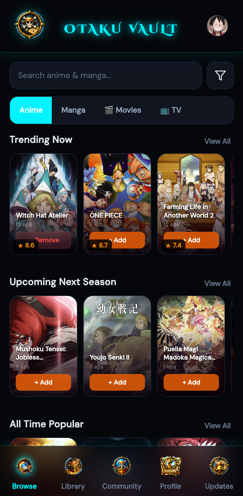
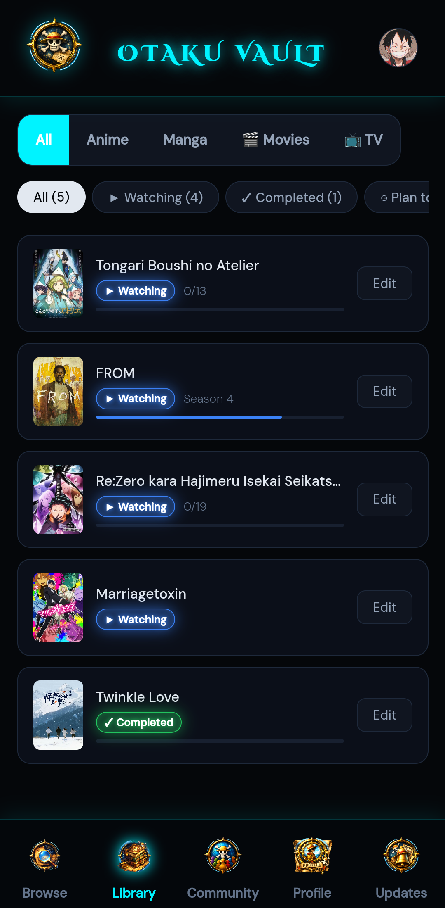
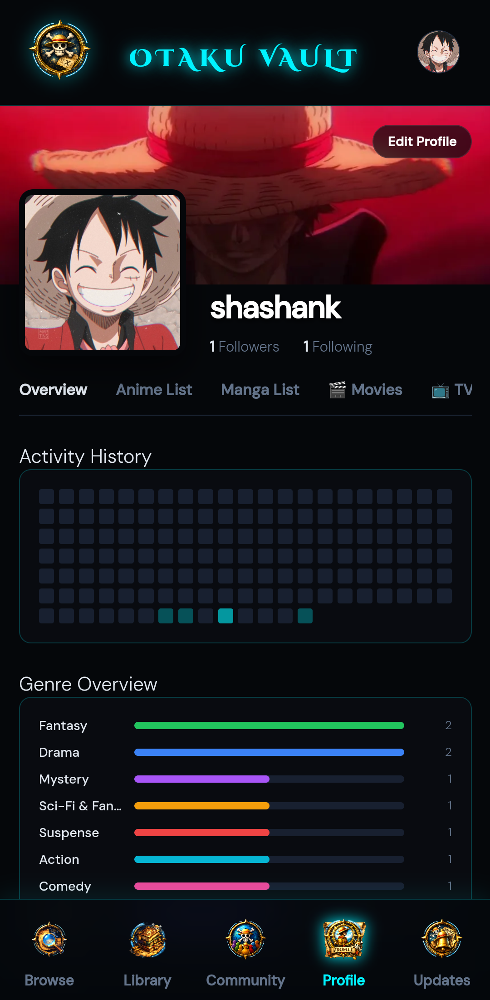
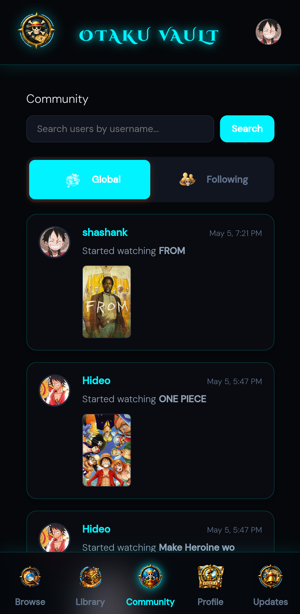
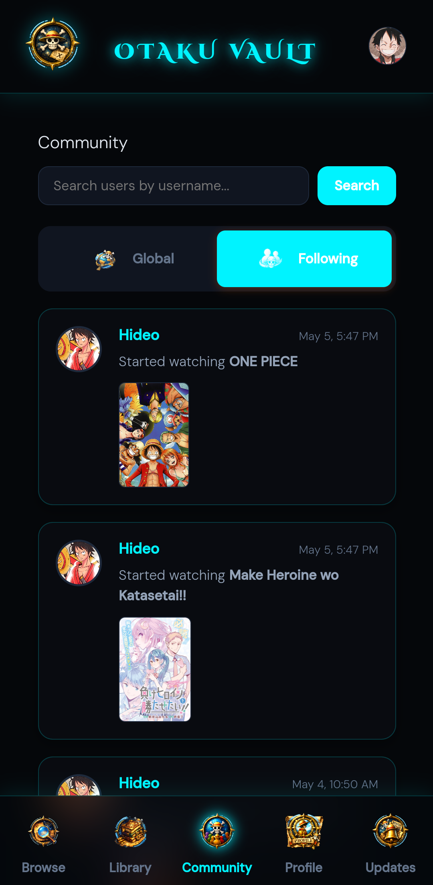
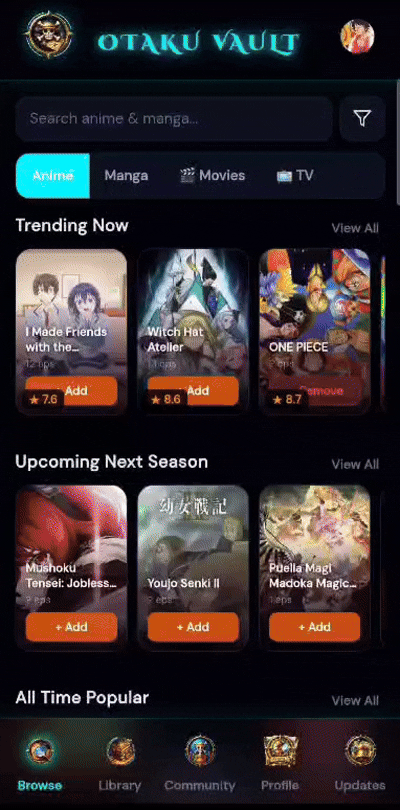

# OtakuVault 🌌

A stunning, blazing-fast native mobile application to track all your Anime, Manga, Movies, and TV shows in one unified, aesthetic vault. Built with web technologies and powered by Capacitor for a native mobile experience.


<div align="center">
  
</div>

## ✨ Key Features

- **Unified Tracking:** Stop using 3 different apps. Track Anime, Manga, Movies, and TV Series side-by-side.
- **Flawless UI & Aesthetics:** Dark mode, glassmorphism, dynamic scrolling animations, and Anime.js powered micro-interactions that make the app feel incredibly premium.
- **Social & Community:** Global feeds, user search, custom profiles, and real-time social update notifications. Follow your friends and see their vault updates instantly.
- **Cross-Platform Syncing:** Built on a Supabase backend to keep your vault seamlessly synced across any device.
- **Native Polish:** Hardware back-button integration, background push notifications, and haptic feedback.

---

## 📸 Screenshots


<div align="center">
   &nbsp;
   &nbsp;
   &nbsp;
   &nbsp;
  
</div>

## 🎥 In Action

<div align="center">
   &nbsp;
  
</div>

---

## 🚀 Getting Started

Follow these steps to run OtakuVault locally or build it for your own device.

### Prerequisites
- [Node.js](https://nodejs.org/) installed
- [Android Studio](https://developer.android.com/studio) (for Android compilation)
- A [Supabase](https://supabase.com/) account (for backend sync)
- A [TMDB](https://www.themoviedb.org/) API key (for Movie/TV data)

### 1. Clone the Repository
```bash
git clone https://github.com/Shashankmy/OtakuVault.git
cd OtakuVault
```

### 2. Install Dependencies
```bash
npm install
npm install @capacitor/app @capacitor/local-notifications
```

### 3. Setup API Keys
Open `www/index.html` and locate the configuration section near the top. Paste your respective keys:

```javascript
const SUPABASE_URL = 'YOUR_SUPABASE_URL';
const SUPABASE_ANON_KEY = 'YOUR_SUPABASE_ANON_KEY';
const TMDB_API_KEY = 'YOUR_TMDB_API_KEY';
```

### 4. Run & Build
Sync the web assets to the native Android project:
```bash
npx cap sync android
```
Then, open the project in Android Studio to build and run it on your device/emulator:
```bash
npx cap open android
```

---

## 🛠️ Built With
- **HTML/CSS/JS (Vanilla):** Zero-bloat, maximum performance UI.
- **Anime.js:** For smooth, physics-based micro-interactions.
- **Capacitor:** Native bridge and mobile packaging.
- **Supabase:** Backend, authentication, and real-time database.
- **Anilist API, MangaDex API, & TMDB API:** For fetching massive media databases.

## 📄 License
This project is open-source and available under the [MIT License](LICENSE).

---

## 💬 A Note from the Creator

This project was built purely for fun and to push my limits with full-stack development — experimenting with everything from real-time databases and social feeds to native Android packaging, all while working alongside AI tools to see how far things could go.

If you're interested in using the app, want a copy of the APK, or just want to say hi — feel free to reach out. It's completely free, no strings attached.

📧 **shashimy12345@gmail.com**
